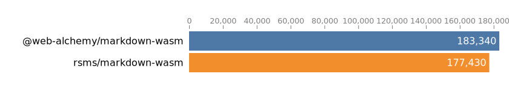

# WebAssembly build of Rust lib [`pulldown-cmark`](https://github.com/pulldown-cmark/pulldown-cmark) for Node.js

## Installation

```shell
npm install @web-alchemy/markdown-wasm
```

## Usage example:

```javascript
import { parse } from '@web-alchemy/markdown-wasm';

const markdownSource = `# title
  Some text
  
  
`;

const html = parse(markdownSource);

console.log(html)
/*
<h1>title</h1>
  <p>Some text</p>
  <p></p>
*/
```

## Using non standard features

You can use additional (non CommonMark)  [features via `Options`](https://docs.rs/pulldown-cmark/latest/pulldown_cmark/struct.Options.html). They work as bit masks.

```javascript
import { parse, Flags } from '@web-alchemy/markdown-wasm';

const source = `# my todo list { #list-head-id .head-class }
- [x] check 1
- [x] check 2
- [ ] check 3
`;

const FLAGS = new Flags();
const flags = FLAGS.ENABLE_HEADING_ATTRIBUTES | FLAGS.ENABLE_TASKLISTS;
const html = parse(source, flags);
/*
<h1 id="list-head-id" class="head-class">my todo list</h1>
<ul>
  <li><input disabled="" type="checkbox" checked=""/>  check 1</li>
  <li><input disabled="" type="checkbox" checked=""/> check 2</li>
  <li><input disabled="" type="checkbox"/> check 3</li>
</ul>
*/
```

## Benchmark

Results of [benchmark](https://github.com/rsms/markdown-wasm) (ops/s):



## Development

- Install [Node.js](https://nodejs.org/)
- Install dev dependencies - `npm ci`.
- Modify source code in `src` folder and write tests in `test` folder.
- Create build - `node --run build`. `pkg` folder should contains npm package files.
- Run tests - `node --run test`.